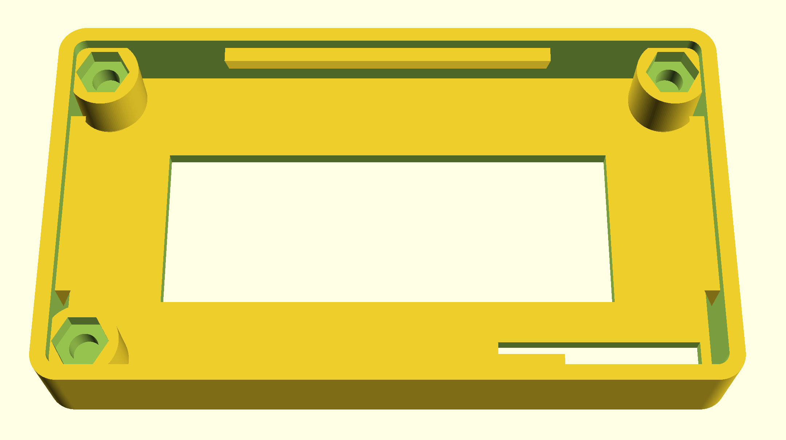
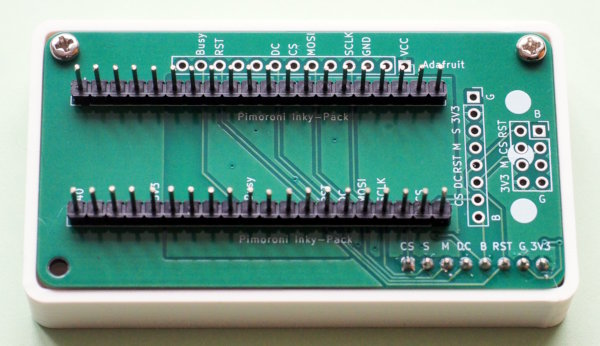
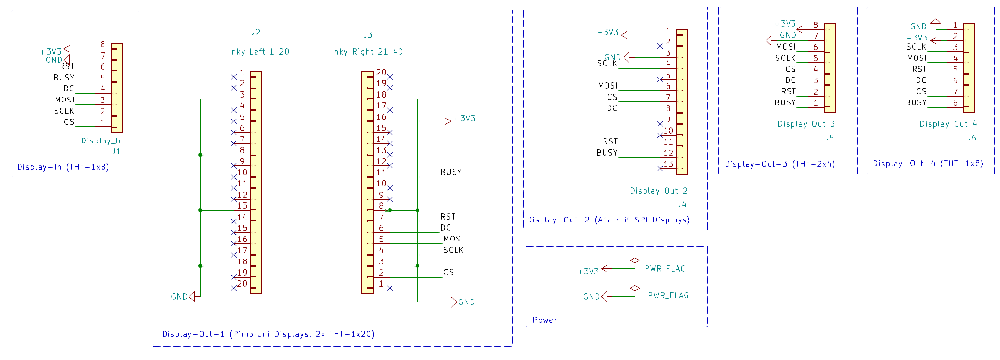
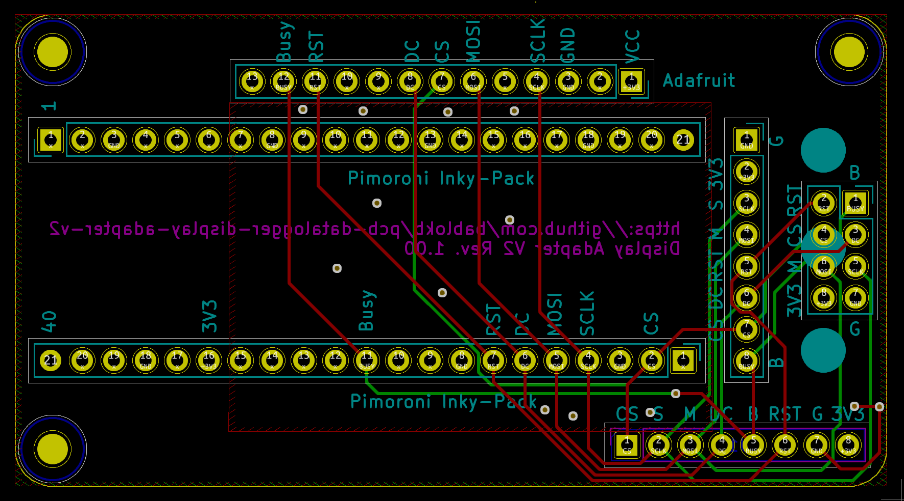
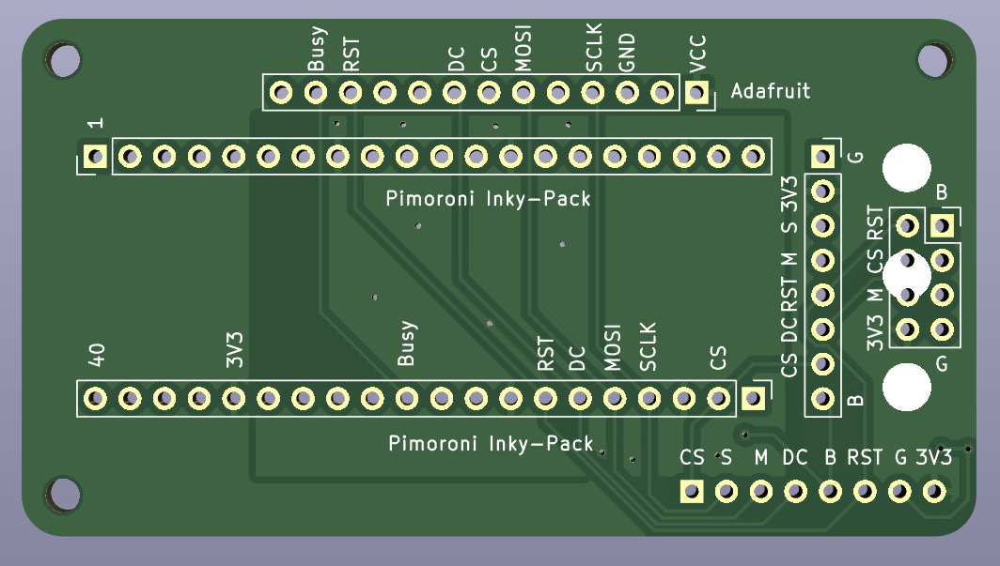
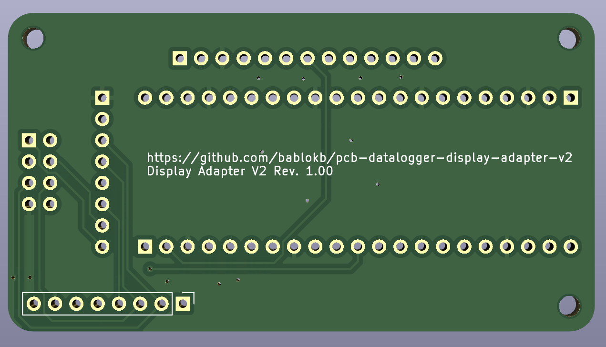

KiCAD-Designfiles
=================

Here are the KiCAD (v7) design-files for a generic display-adapter-PCB.

The adapter supports the following displays:

  - Pimoroni Inky-Pack (and other display-packs with the same pinout)
  - Adafruit SPI-displays
  - WeAct-Studio 2.9" B/W e-Ink (with 2x4 connector)
  - Various generic SPI-TFT displays (many share the same pinout)

The pinout of the "input pins" is optimized for these datalogger PCB:

  - [Datalogger-v2 PCB](https://github.com/bablokb/pcb-datalogger-v2)
  - [Datalogger-v3 PCB](https://github.com/bablokb/pcb-datalogger-v3)

There is a minimal case available for the display, mainly to stabilze it:

Schematic
---------

Layout
------

3D-Views
--------

License
-------

[![CC BY-SA 4.0][cc-by-sa-shield]][cc-by-sa]

This work is licensed under a
[Creative Commons Attribution-ShareAlike 4.0 International
License][cc-by-sa].

[![CC BY-SA 4.0][cc-by-sa-image]][cc-by-sa]

[cc-by-sa]: http://creativecommons.org/licenses/by-sa/4.0/
[cc-by-sa-image]: https://licensebuttons.net/l/by-sa/4.0/88x31.png
[cc-by-sa-shield]:
https://img.shields.io/badge/License-CC%20BY--SA%204.0-lightgrey.svg
